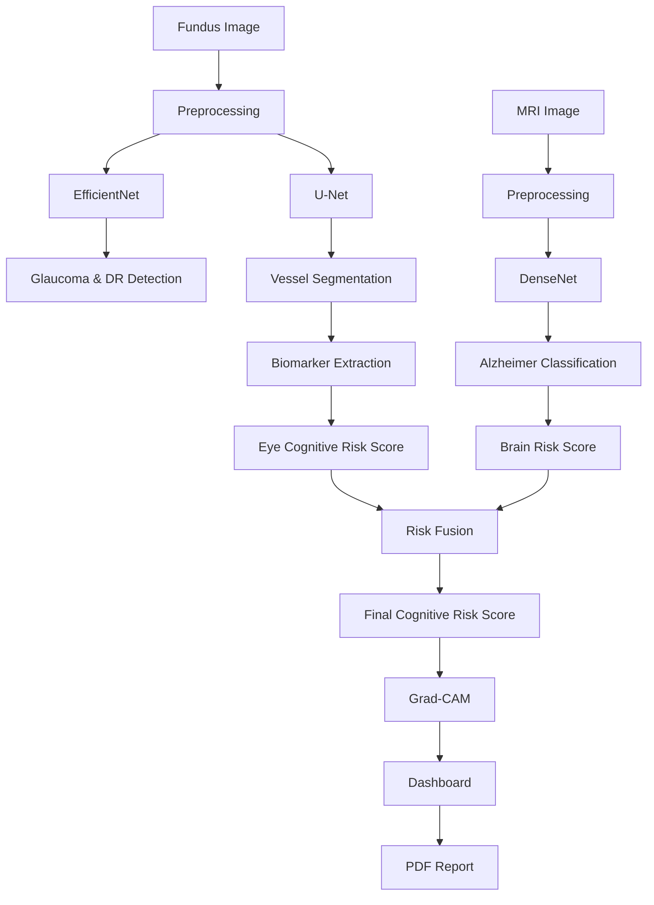

# 🧠 Neuro-Optho AI

### 👁️ Retinal Disease Detection | 🧠 Alzheimer's Classification | 🔬 Cognitive Risk Assessment

---

## 📌 Overview

Neuro-Optho AI is a multimodal deep learning framework developed for early cognitive risk assessment and neurodegenerative disease screening by integrating retinal fundus image analysis and brain MRI classification.

The system combines retinal disease detection, retinal vessel biomarker extraction, Alzheimer's disease classification, multimodal risk fusion, and explainable AI to generate an overall cognitive risk score for clinical decision support.

---

## 🎯 Key Highlights

✨ Multimodal AI-Based Cognitive Risk Assessment

✨ Retinal Disease Detection using EfficientNet

✨ Retinal Vessel Segmentation using U-Net

✨ Alzheimer's Stage Classification using DenseNet

✨ Eye Cognitive Risk Scoring

✨ Brain Risk Scoring

✨ Explainable AI with Grad-CAM

✨ Automated Medical Report Generation

---

## 🧠 System Architecture

```text
Fundus Images
      │
      ▼
 Image Preprocessing
      │
      ▼
 EfficientNet
 (Glaucoma + DR Detection)
      │
      ▼
 U-Net
 (Vessel Segmentation)
      │
      ▼
 Biomarker Extraction
      │
      ▼
 Eye Cognitive Risk Score
      │
      ▼

MRI Images
      │
      ▼
 DenseNet
 (Alzheimer Classification)
      │
      ▼
 Brain Risk Score
      │
      ▼

 Multimodal Risk Fusion
      │
      ▼
 Final Cognitive Risk Score
      │
      ▼
 Grad-CAM Explainability
      │
      ▼
 Dashboard & PDF Reports
```

---

## ⚙️ Core Components

### 👁️ Retinal Disease Detection — EfficientNet

- Detects Glaucoma
- Detects Diabetic Retinopathy
- Generates Disease Probability Scores
- Transfer Learning Based Classification

### 🌐 Retinal Vessel Segmentation — U-Net

- Extracts Retinal Blood Vessels
- Generates Binary Vessel Masks
- Supports Biomarker Computation

Biomarkers Extracted:

- Vessel Density
- Branch Density
- Tortuosity Index
- Vascular Structural Complexity

### 🧠 Alzheimer's Classification — DenseNet

- Processes Brain MRI Images
- Classifies Alzheimer's Disease Stages
- Detects Mild Cognitive Impairment (MCI)
- Generates Brain Risk Score

### 📊 Multimodal Risk Fusion

Combines:

- Eye Cognitive Risk Score
- Brain Risk Score

Using a weighted fusion mechanism to generate:

### 🎯 Final Cognitive Risk Score

### 🔍 Explainable AI — Grad-CAM

- Generates Visual Heatmaps
- Highlights Important Regions
- Improves Clinical Interpretability
- Supports Trustworthy AI

---

## 🚦 System Outputs

| Module | Output |
|----------|----------|
| EfficientNet | Glaucoma / DR Prediction |
| U-Net | Vessel Segmentation Mask |
| Biomarker Engine | Vessel Metrics |
| DenseNet | Alzheimer's Classification |
| Fusion Engine | Cognitive Risk Score |
| Grad-CAM | Explainability Heatmap |
| Dashboard | Medical Report |

---

## 📊 Working Pipeline



---

## ⚡ Features

- Real-Time AI Inference
- Automated Biomarker Extraction
- Explainable Predictions
- Multimodal Risk Assessment
- Clinical Dashboard
- PDF Report Generation
- Telemedicine Ready

---

## 🛠️ Tech Stack

### Frontend

- React.js
- Tailwind CSS
- Axios
- Vite

### Backend

- Flask
- Flask-CORS
- Python

### Deep Learning

- TensorFlow
- Keras
- OpenCV
- NumPy
- Pandas
- Scikit-Learn

### Models Used

| Model | Purpose |
|---------|---------|
| EfficientNet | Glaucoma & Diabetic Retinopathy Detection |
| U-Net | Retinal Vessel Segmentation |
| DenseNet | Alzheimer's MRI Classification |
| Grad-CAM | Explainable AI Visualization |

---

## ▶️ How to Run

### Clone Repository

```bash
git clone https://github.com/your-username/Neuro-Optho-AI.git
cd Neuro-Optho-AI
```

### Create Virtual Environment

```bash
python -m venv venv
```

### Activate Environment

#### Windows

```bash
venv\Scripts\activate
```

#### Linux / Mac

```bash
source venv/bin/activate
```

### Install Backend Dependencies

```bash
pip install -r requirements.txt
```

### Run Flask Backend

```bash
python app.py
```

Backend runs at:

```text
http://127.0.0.1:5000
```

### Frontend Setup

```bash
cd frontend

npm install

npm run dev
```

Frontend runs at:

```text
http://localhost:5173
```

---

## 📁 Project Structure

```bash
Neuro-Optho-AI/
│
├── frontend/
│   ├── src/
│   ├── components/
│   ├── pages/
│   └── assets/
│
├── backend/
│   ├── app.py
│   ├── routes/
│   ├── models/
│   │   ├── EfficientNet/
│   │   ├── U-Net/
│   │   └── DenseNet/
│   │
│   ├── reports/
│   └── utils/
│
├── datasets/
│   ├── Fundus/
│   └── MRI/
│
├── assets/
│   ├── architecture.png
│   ├── workflow.png
│   ├── dashboard.png
│   └── banner.png
│
├── requirements.txt
└── README.md
```

---

## 📸 Project Screenshots

### Dashboard


### Grad-CAM Visualization


### Vessel Segmentation


---

## 📌 Applications

- Neurodegenerative Disease Screening
- Alzheimer's Risk Assessment
- Ophthalmic Disease Diagnosis
- Telemedicine Platforms
- Clinical Decision Support Systems
- Healthcare AI Research

---

## 🔮 Future Enhancements

- Longitudinal Patient Monitoring
- Electronic Health Record Integration
- Cloud Deployment
- Multi-Disease Prediction
- Mobile Application Support
- Real-Time Hospital Integration

---

## 👨‍💻 Authors

### Faculty Mentors

- Mrs. G. Aishwarya
- Mrs. P. Pavani

### Student Team

- Avinash Valavoju
- N. Joy Darren
- E. Ramya
- N. Sarayu

---

## 📄 License

This project is developed for academic research, healthcare innovation, and educational purposes.

---

## 🌟 Show Your Support

If you like this project:

⭐ Star this repository

🍴 Fork this repository

📢 Share it with the community

---

## 🚀 Vision

> "The eye is the window to the brain. Neuro-Optho AI transforms retinal and neuroimaging data into actionable cognitive insights through multimodal artificial intelligence."
