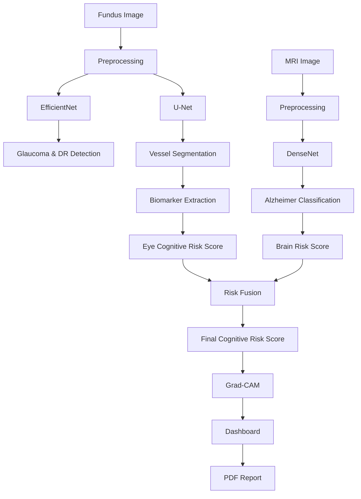

# 🧠 Neuro-Optho AI

### 👁️ Retinal Disease Detection | 🧠 Alzheimer's Classification | 🔬 Cognitive Risk Assessment

---

## 🏷️ Badges

<p align="center">


</p>

---

## 📌 Overview

Neuro-Optho AI is a multimodal deep learning framework developed for early cognitive risk assessment and neurodegenerative disease screening by integrating retinal fundus image analysis and brain MRI classification.

The system combines:

- 👁️ Retinal Disease Detection
- 🌐 Retinal Vessel Biomarker Extraction
- 🧠 Alzheimer's Disease Classification
- 📊 Multimodal Risk Fusion
- 🔍 Explainable AI Visualization

to generate an overall cognitive risk score for clinical decision support.

---

## 🎯 Key Highlights

✨ Multimodal AI-Based Cognitive Risk Assessment

✨ Retinal Disease Detection using EfficientNet

✨ Retinal Vessel Segmentation using U-Net

✨ Alzheimer's Stage Classification using DenseNet

✨ Eye Cognitive Risk Scoring

✨ Brain Risk Scoring

✨ Explainable AI with Grad-CAM

✨ Automated Medical Report Generation

---

## 🧠 System Architecture

```text
Fundus Images
      │
      ▼
 Image Preprocessing
      │
      ▼
 EfficientNet
 (Glaucoma + DR Detection)
      │
      ▼
 U-Net
 (Vessel Segmentation)
      │
      ▼
 Biomarker Extraction
      │
      ▼
 Eye Cognitive Risk Score
      │
      ▼

MRI Images
      │
      ▼
 DenseNet
 (Alzheimer Classification)
      │
      ▼
 Brain Risk Score
      │
      ▼

 Multimodal Risk Fusion
      │
      ▼
 Final Cognitive Risk Score
      │
      ▼
 Grad-CAM Explainability
      │
      ▼
 Dashboard & PDF Reports
```

---

## ⚙️ Core Components

### 👁️ Retinal Disease Detection — EfficientNet

- Detects Glaucoma
- Detects Diabetic Retinopathy
- Generates Disease Probability Scores
- Transfer Learning Based Classification

### 🌐 Retinal Vessel Segmentation — U-Net

- Extracts Retinal Blood Vessels
- Generates Binary Vessel Masks
- Supports Biomarker Computation

Biomarkers Extracted:

- Vessel Density
- Branch Density
- Tortuosity Index
- Vascular Structural Complexity

### 🧠 Alzheimer's Classification — DenseNet

- Processes Brain MRI Images
- Classifies Alzheimer's Disease Stages
- Detects Mild Cognitive Impairment (MCI)
- Generates Brain Risk Score

### 📊 Multimodal Risk Fusion

Combines:

- Eye Cognitive Risk Score
- Brain Risk Score

Using a weighted fusion mechanism to generate:

### 🎯 Final Cognitive Risk Score

### 🔍 Explainable AI — Grad-CAM

- Generates Visual Heatmaps
- Highlights Important Regions
- Improves Clinical Interpretability
- Supports Trustworthy AI

---

## 🚦 System Outputs

| Module | Output |
|----------|----------|
| EfficientNet | Glaucoma / DR Prediction |
| U-Net | Vessel Segmentation Mask |
| Biomarker Engine | Vessel Metrics |
| DenseNet | Alzheimer's Classification |
| Fusion Engine | Cognitive Risk Score |
| Grad-CAM | Explainability Heatmap |
| Dashboard | Medical Report |

---

## 📊 Working Pipeline



---

## ⚡ Features

- Real-Time AI Inference
- Automated Biomarker Extraction
- Explainable Predictions
- Multimodal Risk Assessment
- Clinical Dashboard
- PDF Report Generation
- Telemedicine Ready

---

## 🛠️ Tech Stack

### Frontend


### Backend


### Deep Learning & AI


### AI Models


---

## ▶️ How to Run

### Clone Repository

```bash
git clone https://github.com/your-username/Neuro-Optho-AI.git
cd Neuro-Optho-AI
```

### Create Virtual Environment

```bash
python -m venv venv
```

### Activate Environment

#### Windows

```bash
venv\Scripts\activate
```

#### Linux / Mac

```bash
source venv/bin/activate
```

### Install Backend Dependencies

```bash
pip install -r requirements.txt
```

### Run Flask Backend

```bash
python app.py
```

Backend runs at:

```text
http://127.0.0.1:5000
```

### Frontend Setup

```bash
cd frontend
npm install
npm run dev
```

Frontend runs at:

```text
http://localhost:5173
```

---

## 📁 Project Structure

```bash
Neuro-Optho-AI/
│
├── frontend/
│   ├── src/
│   ├── components/
│   ├── pages/
│   └── assets/
│
├── backend/
│   ├── app.py
│   ├── routes/
│   ├── models/
│   │   ├── EfficientNet/
│   │   ├── U-Net/
│   │   └── DenseNet/
│   │
│   ├── reports/
│   └── utils/
│
├── datasets/
│   ├── Fundus/
│   └── MRI/
│
├── assets/
│   ├── architecture.png
│   ├── workflow.png
│   ├── dashboard.png
│   ├── gradcam.png
│   └── vessel_segmentation.png
│
├── requirements.txt
└── README.md
```

---

## 📌 Applications

- Neurodegenerative Disease Screening
- Alzheimer's Risk Assessment
- Ophthalmic Disease Diagnosis
- Telemedicine Platforms
- Clinical Decision Support Systems
- Healthcare AI Research

---

## 🔮 Future Enhancements

- Longitudinal Patient Monitoring
- Electronic Health Record Integration
- Cloud Deployment
- Multi-Disease Prediction
- Mobile Application Support
- Real-Time Hospital Integration

---

## 👨‍💻 Authors

### Faculty Mentors

- Mrs. G. Aishwarya
- Mrs. P. Pavani

### Student Team

- Avinash Valavoju
- N. Joy Darren
- E. Ramya
- N. Sarayu

---

## 📄 License

This project is developed for academic research, healthcare innovation, and educational purposes.

---

## 🌟 Show Your Support

If you like this project:

⭐ Star this repository

🍴 Fork this repository

📢 Share it with the community

---

## 🚀 Vision

> "The eye is the window to the brain. Neuro-Optho AI transforms retinal and neuroimaging data into actionable cognitive insights through multimodal artificial intelligence."
